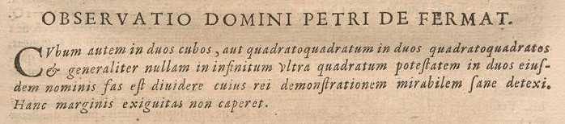
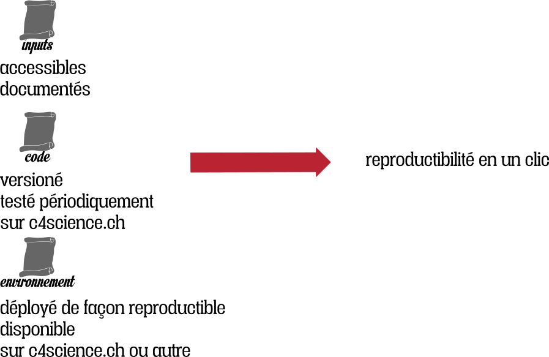

# Reproductibilité

---

---

<i>
Au contraire, il est impossible de partager soit un cube en deux cubes, soit un bicarré en deux bicarrés, soit en général une puissance quelconque supérieure au carré en deux puissances de même degré : j'en ai découvert une démonstration véritablement merveilleuse que cette marge est trop étroite pour contenir.
</i>

 

Le dernier théorème de Fermat 
conjecture: 1367 
Preuve: 1994

---

---

---

# décisions politiques prises en fonction de la recherche

# résultats scientifiques impactent les comportements de la société

# la mauvaise recherche a des effets globaux et peut discréditer toute la recherche

# Reproductibilité

  

- Pouvoir dupliquer une expérience ou une étude
- Repliquer une expérience
- La reproductibilité est un principe de la méthode scientifique

# La reproductibilité est la base de la culture scientifique moderne

  

- le travail est plus facilement repris
- et utilisé comme base de départ par d'autres
- meilleure efficacité sur le long terme, plus d'impact

# Le produit ultime de la recherche est l'article scientifique

---

---

## L'article n'est que une pub par rapport au savoir qui est dans le code et les données.

---

